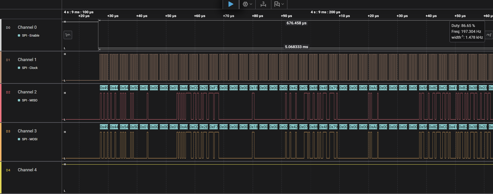

## 🛠  System & Embedded Software Engineer
Focus: Inertial navigation systems (**IMU**/**AHRS**), autonomous vehicles and OS architecture.

My experience combines a practical implementation of navigation systems for **UAVs**/**Robotics** and an understanding of OS architecture (developing kernels from scratch).

### 📦 Key Projects

***

`IDTP`: Inertial Measurement Unit Data Transfer Protocol (IDTP) - lightweight protocol designed for high-performance and reliable IMU data transmission between microcontrollers and host systems. It is tailored for autonomous navigation & robotics where low latency, and data integrity are paramount.

`KFS (Kernel From Scratch)`: monolithic general-purpose UNIX-like kernel in C++ with custom memory management subsystem (Bitmap PMM, SLAB-based allocator), interrupt handler and bare-metal TUI library.

`Eciton (Research)`: Research on microkernel & exokernel architecture and bare-metal memory management in Rust.
