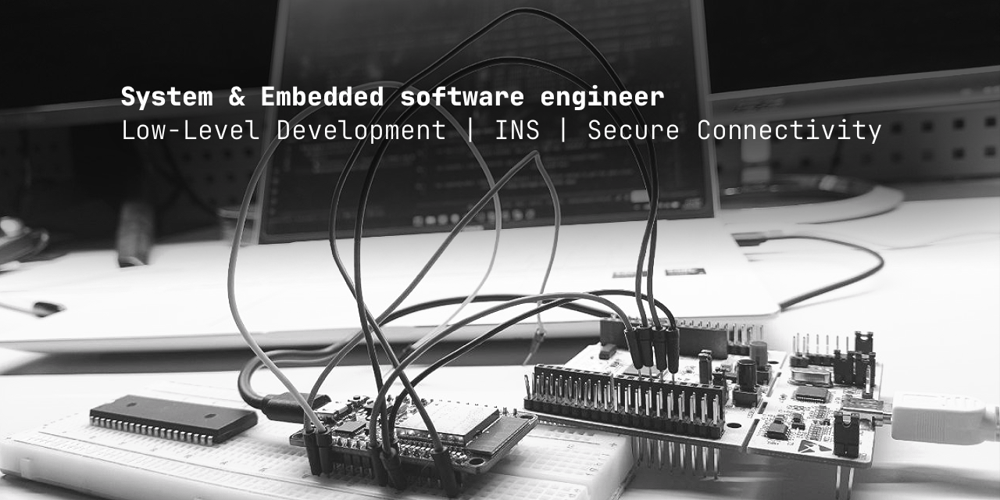
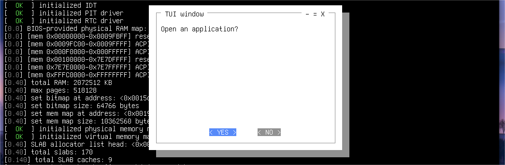
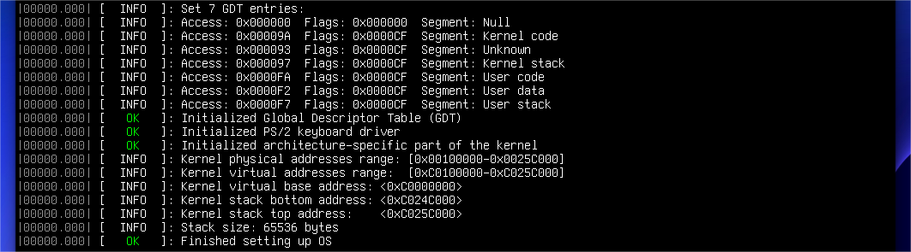

## System & Embedded Software Engineer
Focus: Inertial navigation systems (IMU/AHRS), autonomous vehicles and OS Architecture.

My experience combines an understanding of OS architecture (developing kernels from scratch) and practical implementation of navigation systems for UAVs/Robotics.

### Key Projects

- `KFS (Kernel From Scratch)`: monolithic general-purpose UNIX-like kernel in C++ with custom memory management subsystem (Bitmap PMM, SLAB-based allocator), interrupt handler and bare-metal TUI library.

 

- `Eciton (Research)`: Research on microkernel & exokernel architecture and bare-metal memory management in Rust.

